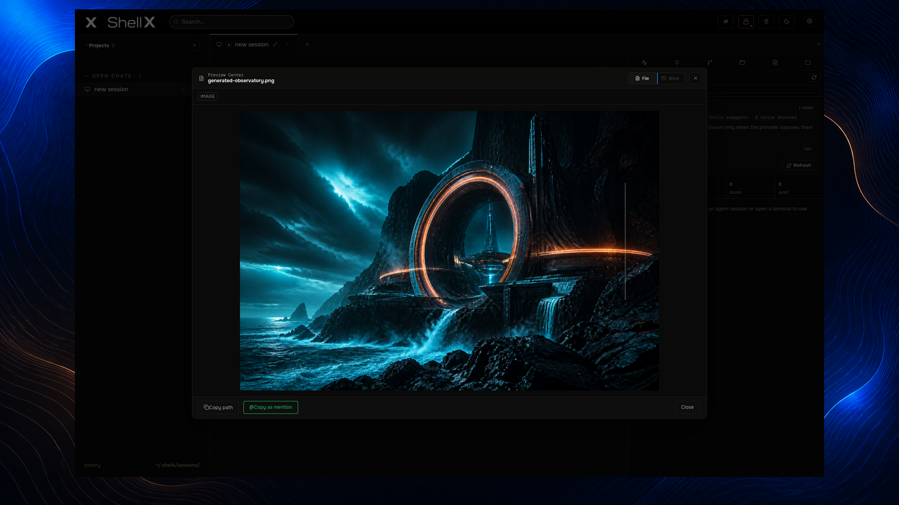
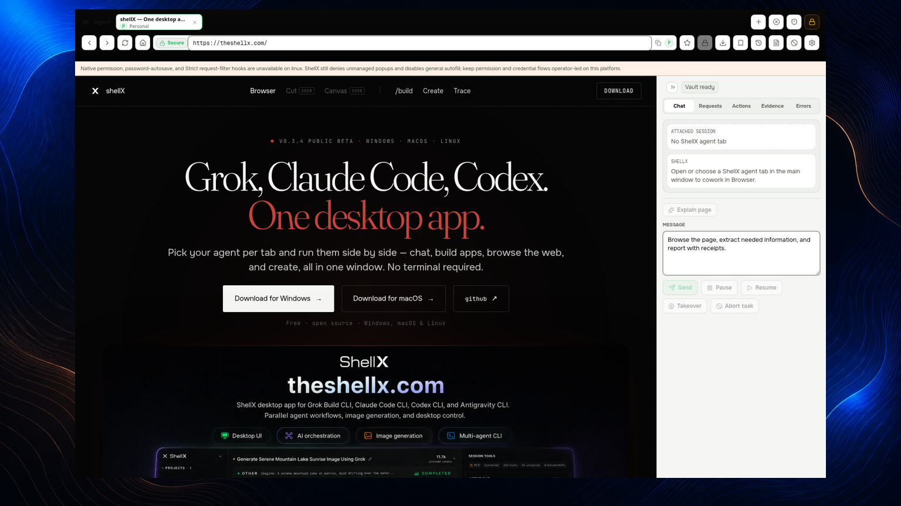
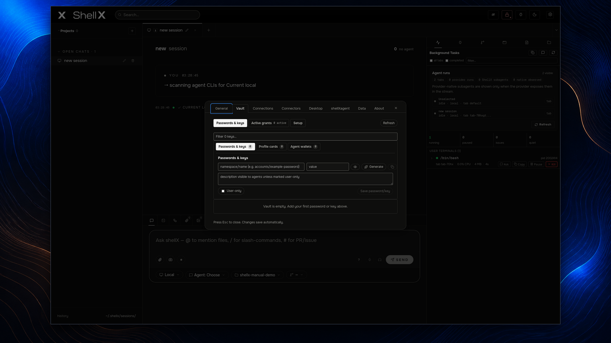

# shellX

Desktop client that hosts xAI's **Grok Build**, Claude Code, Codex
CLI, Antigravity CLI, or any agent speaking the Agent Client Protocol.
It provides tabs, an encrypted vault, voice in / out, session tool
health, traceable file activity, Git review workflows, an MCP
marketplace, file/media preview, Build Mode, and a typed HTTP API for
local scripting.

**Status:** Beta. Windows installers and signed macOS updater archives are
the primary public release artifacts. Linux bundles are experimental release
artifacts when CI passes.

## Documentation and verification

- [Interactive and repository manual](docs/public/SHELLX_MANUAL.md) — every persistent
  ShellX and Browser menu surface has its own explanation and highlighted UI
  state.
- [API reference](docs/public/API.md) and [architecture](docs/public/ARCHITECTURE.md) — the
  public automation contract and the boundaries between the renderer, native
  host, Vault, Browser, and provider runtimes.
- [ShellX Browser module guide](shellx-browser/README.md) — Browser profiles,
  compact agent tools, Vault/session grants, actions, receipts, and debugging.
- [Final release surface gate](release/FINAL_SURFACE_GATE.md) — the exhaustive
  signed-candidate test contract used immediately before publication, not a
  routine development walkthrough.
- [Documentation and public-export workflow](docs/public/DOCUMENTATION_WORKFLOW.md) —
  how one canonical source stays synchronized with the repository manual,
  website source, and reviewed public export without promoting private plans or
  evidence.

## Preview

These previews use UI captured from the installed 0.3.5 release candidate.
The presentation backdrop and the observatory shown as session content are
generated; ShellX controls, Browser chrome, and layout have not been repainted.
The Browser preview opens the live public `https://theshellx.com` homepage in
the exact installed page bounds.

### ShellX workspace



### ShellX Browser



### ShellX Vault



## What it does

- **One UI across local and remote runtimes.** Run the agent locally, in WSL,
  over POSIX SSH, on native Windows OpenSSH, or in WSL reached through Windows
  OpenSSH with the same chat, Vault, previews, and scoped host tools.
- **Grok Imagine-ready media.** Image and video generations from
  grok-build render inline when your Grok account exposes Imagine
  features.
- **Attachment and media board.** File picker, paste, drag/drop,
  screenshots, and Send to shellX create composer chips; Assets keeps
  pending files and generated media in one place.
- **Send files to shellX.** On Windows, Settings -> Desktop can add a
  right-click menu item and SendTo shortcut so selected files open in
  the active shellX composer.
- **Host MCP tools.** Vault, filesystem, network fetch, screenshots,
  vision, memory, process controls, and subagent tools are available to
  the connected agent.
- **Real terminal.** Operator-owned embedded PTY (ConPTY on Windows;
  native PTY support on Linux and macOS). Run `vim`, `htop`, anything
  interactive without exposing an agent-originated ACP shell surface.
- **ShellX Vault.** Keep API keys, passwords, profile cards, inbox
  resources, and agent-wallet references in the local or connected Vault.
  Setup includes recovery-kit creation, remembered-device unlock, manual
  lock, password generation, hidden copy/reveal controls, descriptions,
  user-only visibility, and scoped agent grants through the Vault Request
  Center. The app uses the shared Vault broker for resource schemas,
  grant receipts, recovery, and future standalone Vault parity.
- **Persistent sessions.** Each chat saved as JSONL. Full-content
  search across history.
- **Traceable agent work.** Review file searches, reads, writes,
  deletes, generated media, and activity graph nodes for the active
  session when the connected agent exposes enough log detail.
- **Git workflow surface.** Inspect dirty state and diffs, create local
  checkpoints, and create worktrees from the active session without
  leaving shellX.
- **Tools health.** See MCP health, environment diagnostics,
  search capability status, trace availability, and Preview setup for
  the active tab.
- **Background task cockpit.** Watch running agent/subagent/terminal
  work with health counters, reports, latest output, and explicit
  pause/resume/kill controls.
- **Session-scoped host guidance.** Agents launched by ShellX receive compact
  runtime rules and the `shellx-host` MCP surface for Vault, Browser, Debug
  API, `/build`, handoffs, and UI evidence. Direct CLI agents do not inherit a
  global ShellX skill, MCP server, or account-wide instruction block.
- **Light and dark appearance.** Settings offers Black, Black + warm, and
  Bright themes and persists the selected shellX UI appearance.
- **Build Mode.** `/build "<objective>"` writes a scoped scratchboard,
  lets the agent plan + work across multiple turns, records host
  receipts for checkpoints/review/verification, and uses Preview Doctor
  evidence for UI/web work.
- **Full Auto by default for agent work.** ShellX is built for
  agent-first execution. Provider sessions and Build workflows use
  the providers' auto/bypass permission mode. Treat this like giving the selected
  agent active control inside the selected project/environment.
- **Work Preview.** Static HTML, web apps, and Expo web apps can run in
  a loopback preview with logs, diagnostics, and passive setup checks in
  the Tools panel.
- **Outside connectors.** Telegram can route allowlisted direct chats to
  a shellX session and reply back. Discord bot messages can land in the
  connector inbox.
- **shellXagent HTTP API.** Authenticated loopback orchestration covers
  sessions, providers, Browser, Vault, preview, Git, settings, diagnostics,
  and release evidence. Native keyboard, palette, and OS-picker behavior is
  exercised through the installed-app WebDriver/native-input drivers.
- **ShellX Browser.** Open a ShellX-owned browser runtime with tabs,
  bookmarks, history, privacy/ad-block modes, HTTPS/security feedback,
  Vault-backed fills, profile-card and email-code helpers, Downloads
  management, full-page screenshots, receipts, replay/debug artifacts, and hard
  gates for sensitive agent actions. Experimental workflow bookmarks let
  agents save successful repeated tasks as recipe-backed fast tracks and
  replay them through the same Browser/Vault gates. Browser Chat attaches a
  task to a real ShellX Grok, Codex, Claude, or Antigravity session and streams
  that session's actual messages and tool activity while preserving the visible
  pause, takeover, abort, and Request Center controls. Compact observations and
  stable ref actions cover the top document, same-origin frames, and open shadow
  roots within bounded traversal limits; cross-origin frames remain isolated.
  Provider sessions see two routed Browser tools (`browser_read` and
  permission-gated `browser_act`) instead of 32 repeated compatibility schemas. Observe
  responses default to a 3,000-byte structured payload, with larger/full page
  content available only through explicit extraction or opt-in controls.
- **Auto-updater.** Signature-verified through Tauri's updater plugin on
  Windows, macOS, and Linux AppImage installs, using release manifests
  generated from staged signed artifacts. Linux `.deb` and `.rpm` installs use
  the distro package workflow and must be updated manually.

## Install

### Windows

Download the latest Windows installer from the
[Releases page](https://github.com/martinsbrezauckis/shellx/releases).

### Linux

Linux release artifacts are experimental. Use the `.AppImage` when you want
ShellX's in-app updater. The `.deb` and `.rpm` packages can be installed when
they match your distro, but those package formats must be updated manually from
the Releases page. If a
bundle is not attached for your distro, build from source:

```bash
git clone https://github.com/martinsbrezauckis/shellx
cd shellx
pnpm install
pnpm tauri build
```

### macOS

Download the latest notarized macOS artifact from the
[Releases page](https://github.com/martinsbrezauckis/shellx/releases) when a
macOS asset is attached. Maintainer builds are Developer ID signed,
notarized, stapled, and include the Tauri updater signature.

For local development/testing, build from source:

```bash
git clone https://github.com/martinsbrezauckis/shellx
cd shellx
pnpm install
pnpm tauri:build
```

### Verify a release download

Each release publishes `SHA256SUMS` beside its installers. Download that file
and verify the installer from the same directory with `sha256sum -c
SHA256SUMS` (or compare the listed SHA-256 in PowerShell with
`Get-FileHash -Algorithm SHA256`). OS signing/notarization checks remain
separate and should also pass where the platform provides them.

Requires Node 22+, pnpm, Rust 1.80+, and the
[Tauri 2 prerequisites](https://v2.tauri.app/start/prerequisites/).

## Quick start

1. Launch shellX.
2. **Settings → Connections** — add a connection preset (Local,
   WSL distro, or SSH host).
3. Sign in to the agent CLI you want to use in that environment. For Grok,
   run `grok login` once; on a remote or headless target use
   `grok login --device-auth`. Optional provider keys belong in ShellX Vault as
   normal secrets, for example `xai/api-key` when you intentionally want to
   use an xAI API key instead of OAuth.
4. Open **Vault** from the header or Settings before storing secrets. Create
   or connect a Vault, save the recovery material, and leave remembered-device
   unlock enabled unless you want passphrase entry every time.
5. **New tab -> 📁 pill** -> pick a working folder, then choose the
   environment and agent for the tab.
6. For Grok tabs, press **Connect** or send the first prompt. For Codex,
   Claude, and Antigravity tabs, sending the first prompt starts the provider
   session.
7. Use `/build "<objective>"` for Grok Build Mode or `/pr` to open the
   PR-create modal. ShellX slash commands and the active agent's advertised
   slash commands appear in `/` autocomplete when available.

Security warning: ShellX's normal agent workflow is Full Auto. Use
project-scoped folders and trusted WSL/SSH hosts; do not point an auto
agent at a home directory or a remote machine you do not control.

SSH connections have an explicit remote runtime. Linux, macOS, and WSL sshd
endpoints use direct POSIX SSH. A native Windows OpenSSH endpoint can run a
Windows-installed Codex, Claude, Grok, or Antigravity CLI without WSL by using
the **Windows OpenSSH, run Windows agents** runtime and a Windows project path.
ShellX uses PowerShell-safe CLI discovery and setup, streamed provider launch,
Windows-aware working-directory and file operations, Files and preview reads,
Git, session archives, activity evidence, vision reads, marketplace health
probes, Work Preview servers and tunnels, and ShellX-managed Grok subagent
launch on this runtime. Test Connection and Scan CLIs report destination-side
transport, installation, version, and authentication problems separately.

The separate **Windows OpenSSH, run agents in WSL** option takes a distro name
and keeps the tab in that Linux path frame. Full host tooling in that mode
requires mirrored WSL networking so the WSL process can reach the reverse SSH
tunnel on Windows localhost.

Beta note: ShellX is development-stage software. Features can change,
break, or be overhauled between versions, so keep backups of important
projects and credentials. ShellX Vault keeps secrets under your control;
save your recovery materials and review sensitive browser or agent actions
such as sign-ins, purchases, account changes, data submission, and secret use.

For full quick-start, open **Settings → About → Quick start**.

The synchronized source manual is [docs/public/SHELLX_MANUAL.md](docs/public/SHELLX_MANUAL.md).
Its structured source is `docs/public/manual/shellx/content.json`; run
`pnpm docs:build` after changing it and `pnpm docs:check` before committing.
The version-locked three-target workflow for repository, local website source,
and a staged public-export checkout is documented in
[docs/public/DOCUMENTATION_WORKFLOW.md](docs/public/DOCUMENTATION_WORKFLOW.md).
Contributor-facing interface changes follow
[docs/public/SHELLX_UI_RULES.md](docs/public/SHELLX_UI_RULES.md).
The web-manual destination is
[docs.theshellx.com/manual/shellx](https://docs.theshellx.com/manual/shellx/).
Synchronizing the local website source does not publish it; deployment remains
a separate release operation.

## shellXagent API

The HTTP API covers orchestration and observable application state. Native
keyboard, palette, drag/drop, and OS-picker interactions remain native UI
surfaces and are tested through installed-app drivers rather than synthetic
HTTP equivalents.

- **Authentication:** ShellX-owned clients resolve the per-user loopback
  credential internally. Custom clients use `Authorization: Bearer <token>`
  and must receive that value through a private process-local integration
  without printing or persisting it.
- **Port discovery:** ShellX-owned clients resolve the live Debug API and
  host-MCP endpoints from the active profile instead of hard-coding ports.
- **Agent docs:** installer launches keep the bundled `shellx-host`
  reference under `~/.shellx/agent-docs/`; ShellX-launched sessions receive
  compact runtime guidance without changing global Grok, Codex, or Claude
  skills. The same docs are available from the running app at
  `/agent-doc/manifest` and `/agent-doc/skills/shellx-host/SKILL.md`.
- **Loopback only.** The servers bind to `127.0.0.1`; LAN clients
  cannot reach them.

```bash
# Drive ShellX Browser without exposing its bearer credential
pnpm shellx-browser tabs
pnpm shellx-browser snapshot
pnpm shellx-browser run-steps --steps-json \
  '[{"action":"navigate","url":"https://example.com"},{"action":"observe"}]'
```

Full endpoint inventory: [docs/public/API.md](docs/public/API.md).

## Architecture

- **Tauri 2** — Rust backend + system WebView (WebView2 / WKWebView)
- **React + TypeScript** UI
- **Agent Client Protocol (ACP)** over stdio to the agent
- **portable-pty** for the embedded terminal
- **axum** + **tokio** for the shellXagent HTTP / WS API
- **chacha20poly1305** + **keyring-rs** for the vault

See [docs/public/ARCHITECTURE.md](docs/public/ARCHITECTURE.md) for the wire
diagrams and [docs/public/THREAT_MODEL.md](docs/public/THREAT_MODEL.md) for the
security posture (single-user, local-machine trust boundary).

## License

MIT — see [LICENSE](LICENSE).

## Credits

Created by Martins Brezauckis. shellX connects to Grok through ACP, can run
provider CLIs such as Claude Code and Codex, and can be driven by external
automation through shellXagent.
