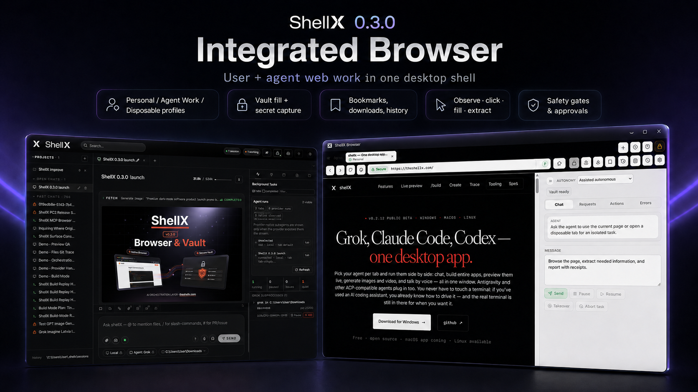
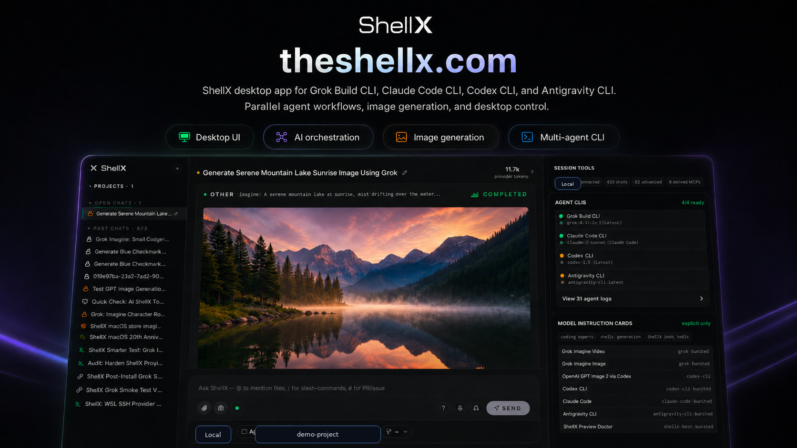
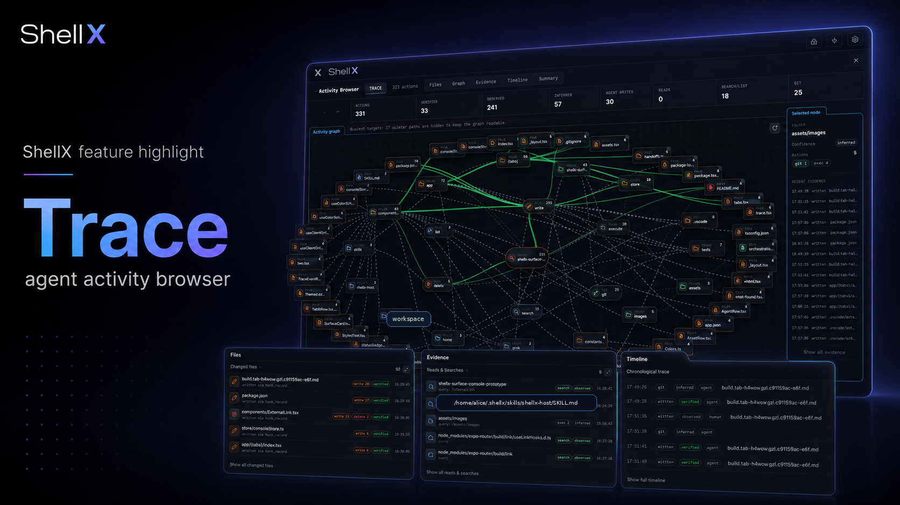

# shellX

Desktop client that hosts xAI's **Grok Build CLI**, Claude Code, Codex
CLI, Antigravity CLI, or any agent speaking the Agent Client Protocol.
It provides tabs, an encrypted vault, voice in / out, session tool
health, traceable file activity, Git review workflows, an MCP
marketplace, file/media preview, Build Mode, and a typed HTTP API for
local scripting.

**Status:** Beta. Windows installers and signed macOS updater archives are
the primary public release artifacts. Linux bundles are experimental release
artifacts when CI passes.

## Preview







## What it does

- **One UI for three runtimes.** Run the agent on local Windows, WSL,
  or SSH with the same chat, vault, previews, and host tools.
- **Grok Imagine-ready media.** Image and video generations from
  grok-build render inline when your Grok account exposes Imagine
  features.
- **Attachment and media board.** File picker, paste, drag/drop,
  screenshots, and Send to shellX create composer chips; Assets keeps
  pending files and generated media in one place.
- **Send files to shellX.** On Windows, Settings -> Desktop can add a
  right-click menu item and SendTo shortcut so selected files open in
  the active shellX composer.
- **Host MCP tools.** Vault, filesystem, network fetch, screenshots,
  vision, memory, process controls, and subagent tools are available to
  the connected agent.
- **Real terminal.** Embedded PTY (ConPTY on Windows, openpty on
  Linux). Run `vim`, `htop`, anything interactive.
- **ShellX Vault.** Keep API keys, passwords, profile cards, inbox
  resources, and agent-wallet references in the local or connected Vault.
  Setup includes recovery-kit creation, remembered-device unlock, manual
  lock, password generation, hidden copy/reveal controls, descriptions,
  user-only visibility, and scoped agent grants through the Vault Request
  Center.
- **Persistent sessions.** Each chat saved as JSONL. Full-content
  search across history.
- **Traceable agent work.** Review file searches, reads, writes,
  deletes, generated media, and activity graph nodes for the active
  session when the connected agent exposes enough log detail.
- **Git workflow surface.** Inspect dirty state and diffs, create local
  checkpoints, and create worktrees from the active session without
  leaving shellX.
- **Tools health.** See MCP health, environment diagnostics,
  search capability status, trace availability, and Preview setup for
  the active tab.
- **Background task cockpit.** Watch running agent/subagent/terminal
  work with health counters, reports, latest output, and explicit
  pause/resume/kill controls.
- **Host skill guidance.** shellX installs a compact `shellx-host` skill so
  hosted agents know about ShellX Vault, the native Browser, MCP tools,
  Debug API, `/build`, provider handoffs, and local UI evidence surfaces.
- **Build Mode.** `/build "<objective>"` writes a scoped scratchboard,
  lets the agent plan + work across multiple turns, records host
  receipts for checkpoints/review/verification, and uses Preview Doctor
  evidence for UI/web work.
- **Full Auto by default for agent work.** ShellX is built for
  agent-first execution. Provider sessions and Build workflows use
  the providers' auto/bypass permission mode unless the user or debug
  driver chooses a stricter mode. Treat this like giving the selected
  agent active control inside the selected project/environment.
- **Work Preview.** Static HTML, web apps, and Expo web apps can run in
  a loopback preview with logs, diagnostics, and passive setup checks in
  the Tools panel.
- **Outside connectors.** Telegram can route allowlisted direct chats to
  a shellX session and reply back. Discord bot messages can land in the
  connector inbox.
- **shellXagent HTTP API.** Every UI surface reachable over loopback
  with a bearer token. Drive shellX from an external agent, Playwright,
  a CI bot, anything.
- **ShellX Browser.** Open a ShellX-owned browser runtime with tabs,
  bookmarks, history, privacy/ad-block modes, HTTPS/security feedback,
  Vault-backed fills, profile-card and email-code helpers, Downloads
  management, full-page screenshots, receipts, replay/debug artifacts, and hard
  gates for sensitive agent actions.
- **Auto-updater.** Signature-verified through Tauri's updater
  plugin, using release manifests generated from staged signed artifacts.

## Install

### Windows

Download the latest Windows installer from the
[Releases page](https://github.com/martinsbrezauckis/shellx/releases).

### Linux

Linux release artifacts are experimental. Download the `.deb`, `.rpm`,
or `.AppImage` from the Releases page if one matches your distro. If a
bundle is not attached for your distro, build from source:

```bash
git clone https://github.com/martinsbrezauckis/shellx
cd shellx
pnpm install
pnpm tauri build
```

### macOS

Download the latest notarized macOS artifact from the
[Releases page](https://github.com/martinsbrezauckis/shellx/releases) when a
macOS asset is attached. Maintainer builds are Developer ID signed,
notarized, stapled, and include the Tauri updater signature.

For local development/testing, build from source:

```bash
git clone https://github.com/martinsbrezauckis/shellx
cd shellx
pnpm install
pnpm tauri:build
```

Requires Node 20+, pnpm, Rust 1.80+, and the
[Tauri 2 prerequisites](https://v2.tauri.app/start/prerequisites/).

## Quick start

1. Launch shellX.
2. **Settings → Connections** — add a connection preset (Local,
   WSL distro, or SSH host).
3. Sign in to the agent CLI you want to use in that environment. For Grok,
   run `grok login` once. Optional provider keys belong in ShellX Vault as
   normal secrets, for example `xai/api-key` when you intentionally want to
   use an xAI API key instead of OAuth.
4. Open **Vault** from the header or Settings before storing secrets. Create
   or connect a Vault, save the recovery material, and leave remembered-device
   unlock enabled unless you want passphrase entry every time.
5. **New tab -> 📁 pill** -> pick a working folder, then choose the
   environment and agent for the tab.
6. For Grok tabs, press **Connect** or send the first prompt. For Codex,
   Claude, and Antigravity tabs, sending the first prompt starts the provider
   session.
7. Use `/build "<objective>"` for Grok Build Mode or `/pr` to open the
   PR-create modal. ShellX slash commands and the active agent's advertised
   slash commands appear in `/` autocomplete when available.

Security warning: ShellX's normal agent workflow is Full Auto. Use
project-scoped folders and trusted WSL/SSH hosts; do not point an auto
agent at a home directory or a remote machine you do not control.

Beta note: ShellX is development-stage software. Features can change,
break, or be overhauled between versions, so keep backups of important
projects and credentials. ShellX Vault keeps secrets under your control;
save your recovery materials and review sensitive browser or agent actions
such as sign-ins, purchases, account changes, data submission, and secret use.

For full quick-start, open **Settings → About → Quick start**.

## shellXagent API

Every UI surface has an HTTP equivalent.

- **Authentication:** `Authorization: Bearer <token>`. Read the token
  from `~/.shellx/shellxagent.token`.
- **Port discovery:** read the live port from
  `~/.shellx/debug-api.port`. The host-MCP HTTP port lives at
  `~/.shellx/mcp-http.port`. Both are written at startup so external
  drivers don't have to hard-code a value.
- **Loopback only.** The servers bind to `127.0.0.1`; LAN clients
  cannot reach them.

```bash
TOKEN=$(cat ~/.shellx/shellxagent.token)
PORT=$(cat ~/.shellx/debug-api.port)
H="Authorization: Bearer $TOKEN"
BASE="http://127.0.0.1:$PORT"

# Health (no auth)
curl "$BASE/health"

# Structural diagnostics
curl -X POST -H "$H" -H "Content-Type: application/json" \
  -d '{}' "$BASE/diagnostics"

# Connect + prompt + abort
curl -X POST -H "$H" -H "Content-Type: application/json" \
  -d '{"connectionId":"<id>","cwd":"<path>","tabId":"t1"}' \
  "$BASE/connect"

curl -X POST -H "$H" -H "Content-Type: application/json" \
  -d '{"prompt":"hello","tabId":"t1"}' \
  "$BASE/prompt"

curl -X POST -H "$H" "$BASE/abort?tabId=t1"

# Screenshot the shellX window
curl -H "$H" "$BASE/screenshot" > shellx.png
```

Full endpoint inventory: [docs/API.md](docs/API.md).

## Architecture

- **Tauri 2** — Rust backend + system WebView (WebView2 / WKWebView)
- **React + TypeScript** UI
- **Agent Client Protocol (ACP)** over stdio to the agent
- **portable-pty** for the embedded terminal
- **axum** + **tokio** for the shellXagent HTTP / WS API
- **chacha20poly1305** + **keyring-rs** for the vault

See [docs/ARCHITECTURE.md](docs/ARCHITECTURE.md) for the wire
diagrams and [docs/THREAT_MODEL.md](docs/THREAT_MODEL.md) for the
security posture (single-user, local-machine trust boundary).

## License

MIT — see [LICENSE](LICENSE).

## Credits

Created by Martins Brezauckis. shellX connects to Grok through ACP, can run
provider CLIs such as Claude Code and Codex, and can be driven by external
automation through shellXagent.
